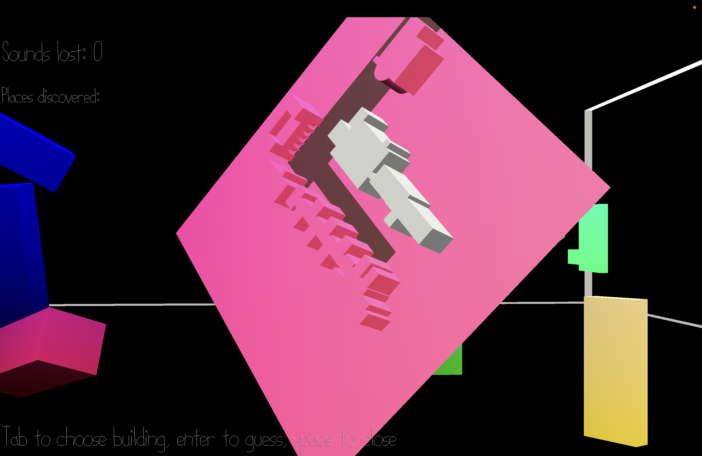

# CMU Soundguessr

Author: Emily Amspoker

Design: This is a game specific to CMU where you have to guess which building you're in based on three sounds from different points in the same area. The sounds are set in an abstract environment based on the place where the sounds were recorded.

Screen Shot:

How To Play:

Walk around with WASD and look around with your mouse. You can press space to pull up the map of CMU (there is only a subset of all CMU buildings currently). One building should be a different color, that's the selected building. You can change your selection with tab and press enter to guess the selected building. Be careful with your guesses! Each time you make an incorrect guess, a sound in the environment will "go out" and you won't be able to listen to it anymore. Once all sounds have gone out, you have lost the game and are trapped in CMU for an eternity. Successfully guess the right building for both levels to escape CMU once and for all!

This game was built with [NEST](NEST.md).
